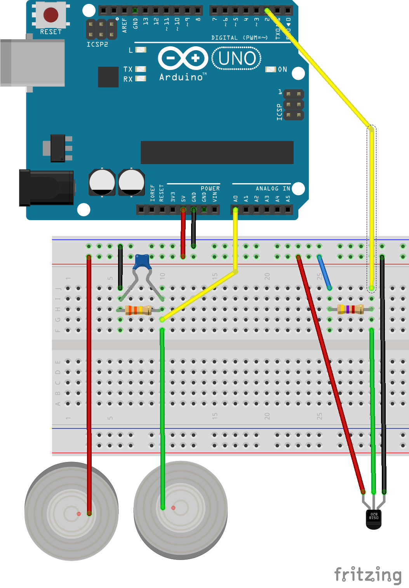

# Psicobiologia Arduino Shiny

Con el fin de apoyar a las clases de Psicobiología en la Facultad de Psicología de la UNAM hemos creado este este
repositorio con los scripts para hacer lecturas de Respuesta Galvánica de la piel (GSR) y de Temperatura. 

Posteriormente intentaremos incluir frecuencia cardíaca al conjunto de pruebas.

## Hardware

Para implementar estos censores es necesario:

- Arduino uno 1
- Resistencia de 330 kΩ
- Resistencia de 4.7 kΩ
- Capacitor de 0.1μF
- Termometro DS18B20
- Dos terminales conductoras (monedas de cobre o aluminio)

Una tabla protoboard y cable, se pueden soldar los componentes para tener un setup fijo.

## Scripts

En la carpeta **ReadAnalogVoltage** de este repositorio contiene los scripts para capturar con Arduino las lecturas de un termometro **DS18B20** y de un circuito
de lectura de resistensia galvánica.

La carpeta **LecturaConR** contiene un script con las funciones para leer, procesar y visualizar los datos que genera el
arduíno.

El archivo **paquetes-requeridos.R** contiene los paquetes que requiere el **Dashboard** para funcionar.

## Funcionamiento

### Circuito 

Esquema del circuito utilizado:

### Dashboard de Lectura

El dashboard se genero como un ``flexdashboard`` que es una simplificación de aplicaciones ``shiny`` a partir un archivo
``markdown``. Esta app se conecta al puerto serial obtienen la información, la grafíca y por último permite descargarla
al disco.

----
1 Puede servir con otros modelos de arduino aunque el voltaje puede ser un problema.
